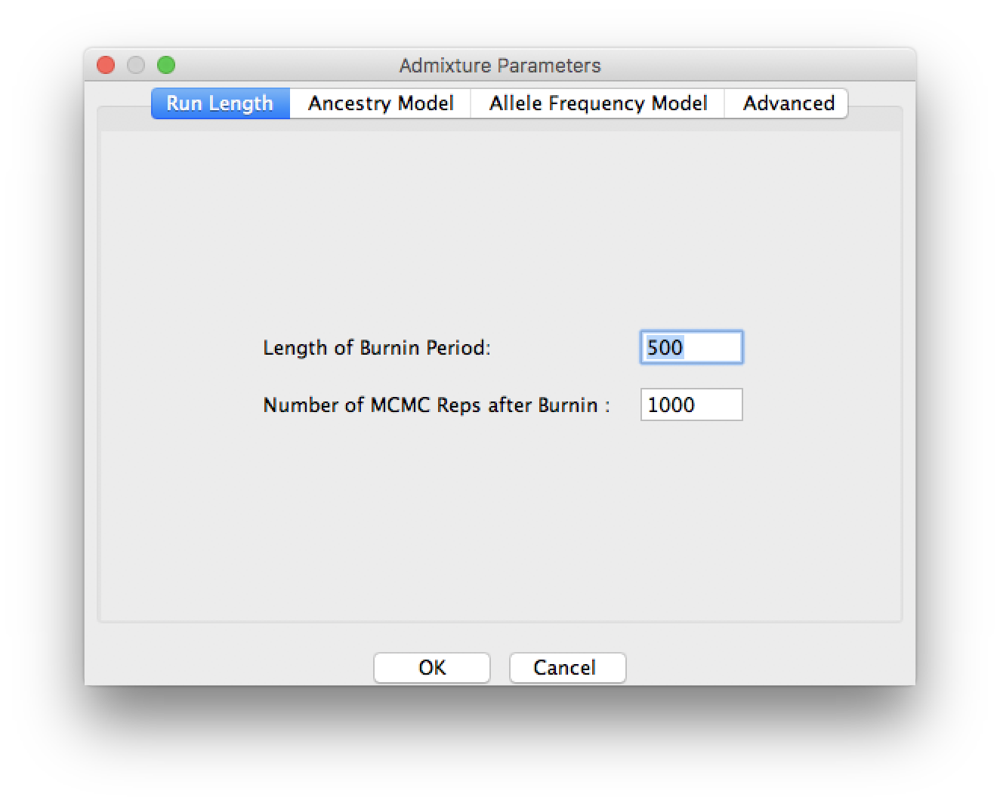
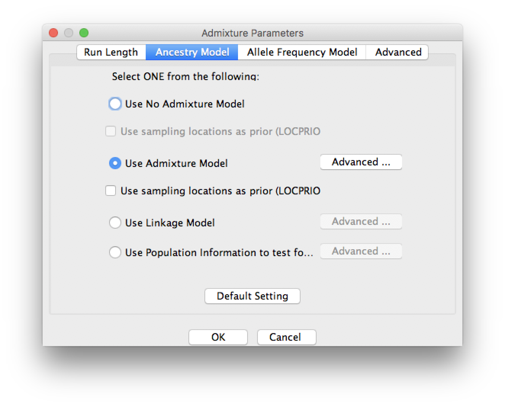
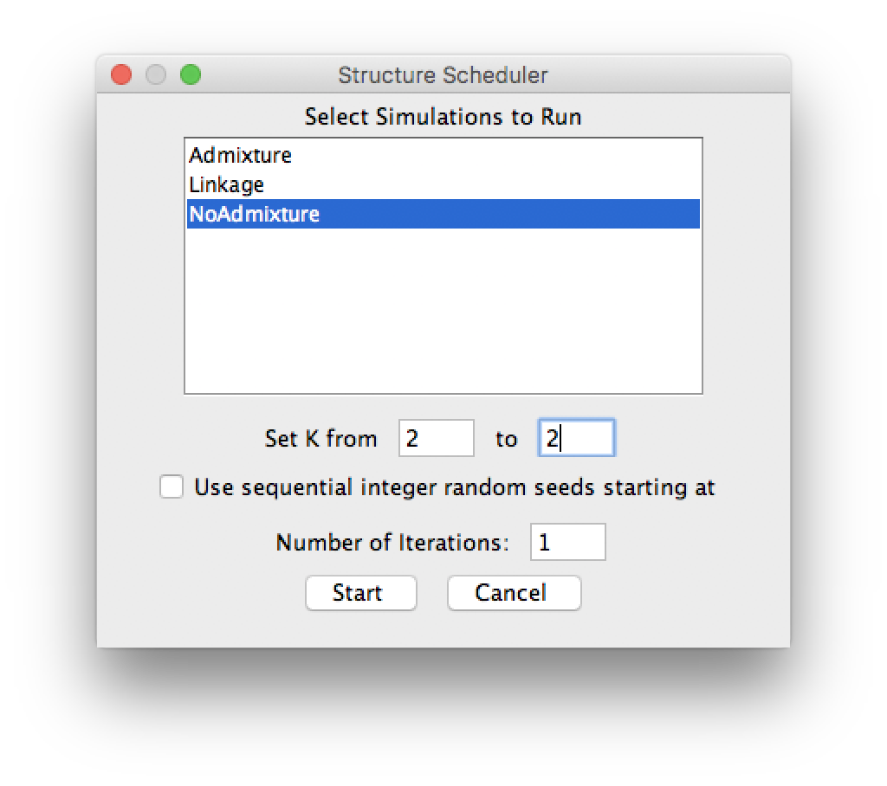

# STRUCTURE Tutorial

This tutorial is copied and modified from the 
[Structure exercise](http://evomics.org/learning/population-and-speciation-genomics/structure-exercise/) 
in the 2016 Workshop on Population and Speciation Genomics in Cesky Krumlov.

The Structure 2.3.4 is available [here](https://web.stanford.edu/group/pritchardlab/structure.html), and 
the user document is available [here](http://www.ccg.unam.mx/~vinuesa/tlem09/docs/structure_doc.pdf).
The basic algorithm was described by 
[Pritchard, Stephens & Donnelly 2000](https://web.stanford.edu/group/pritchardlab/publications/pdfs/PritchardEtAl00.pdf).

# Background and aim 

We all know, approximately, who African-Americans are. Although numbers are controversial, 
a large number of black- skinned people were brought as slaves from the west coast of Africa to the US, 
most in the 17th and 18th centuries. 
Slavery was abolished during the 19th century but in the Southern US legally enforced segregation continued until the 1960s. 
Despite integration and a genetic contribution from American settlers of European origin, 
and to a lesser extent also Native Americans, the population has to a large extent kept its distinct identity to the present. 
In this practical we will use genetic data to investigate their ancestry, doing our analysis using the software STRUCTURE.

# Data

* [AfAmdata1.txt](https://github.com/walterxie/structure-tutorial/raw/master/AfAmdata1.txt)

The 247 microsatellite loci are listed in their order on each of the chromosomes. 
The first line gives the name of the locus, while the second indicates its distance in Centimorgans from the previous marker. 
Each new chromosome is marked by a map distance of -1. 
One Morgan represents a stretch of chromosome in which one genetic crossover event per human generation occurs on average. 
A Centimorgan is a hundredth of this in physical units; 
one Centimorgan typically corresponds to about one million base pairs of DNA.

For each of the 200 individuals the data is stored in a single line. 
The first entry is a label identifying the individual (note that some of the Nigerian individuals have identical labels; 
they are in fact unrelated members of the same family). 
The second entry is a label indicating which population they are from. 
Here 2 is white American and 3 is Nigerian. There then follows data from each of microsatellite loci. 
At each locus each individual has two alleles. These are listed one after another, with the shorter one first.

* [AfAmdata2.txt](https://github.com/walterxie/structure-tutorial/raw/master/AfAmdata2.txt) 

This dataset contains an additional 150 African Americans (thus make sure to specify 350 as the number of individuals), 
labelled as population 1, but is otherwise identical to the first. Perform the same runs as for the first dataset. 

# GUI

## Create a new project

Click _New Project …_ in the _File_ menu:

* Panel 1

Choose a convenient project name, directory, 
and [AfAmdata1.txt](https://github.com/walterxie/structure-tutorial/raw/master/AfAmdata1.txt) as the data file.

* Panel 2

Here you specify the size of the data matrix, as well as how missing data is coded in the input file.
```
Individuals: 200
Ploidy: 2
Number of loci: 247
Missing data: 0
```

* Panel 3

In the next two panels, you specify the format of the input file. Here, the rows included in the input file are specified.
```
Row of marker names: yes
Row of recessive alleles: no
Map distances between loci: yes
Phase information: no
Data file stores data for individuals in a single line: yes
```

* Panel 4

Finally, the columns contained in the input file are specified.
```
Individual ID for each individual: yes
Putative population origin for each individual: yes
USEPOPINFO selection flag: no
Sampling location information: no
Phenotype information: no
Other extra columns: no
```
After you click _Finish_ and _Proceed_, the program should ask if the data are phased. Click _No_.

## Define a new parameter set

Click the _New Parameter Set_ button:

Run the MCMC with a burnin of 500 iterations followed by a further 1000 iterations.



Try the following three ancestry models one by one:

1. No admixture model

This model assumes that each individual receives all of its ancestry from only one of K populations. 
The model output is then the probability that the individual comes from each population.

2. Admixture model

This model assumes that each individual receives a proportion of ancestry q<sub>k</sub> from population k. 
The output is then the estimated proportion of ancestry from each of the K populations. 
This model assumes that each locus has the same probability of coming from the K populations, independent of its neighbours.



3. Linkage model

The linkage model is the same as the admixture model but ancestry comes in chunks, 
so that neighbouring loci are more likely to come from the same population.

## Start a Job

Run STRUCTURE by clicking _Start a Job_ in the _Project_ menu. Select the parameter set you just defined.



## Plot

Click the result to view the plots after the run has completed.


You can use `git clone https://github.com/walterxie/structure-tutorial.git`.


